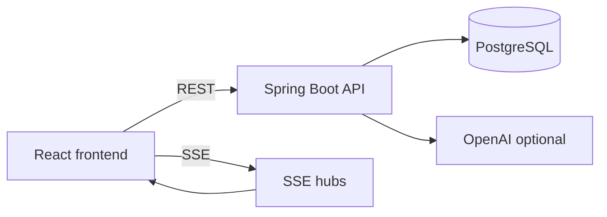
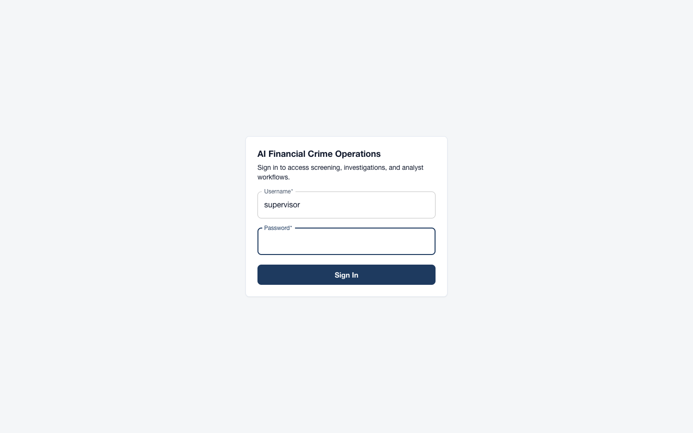
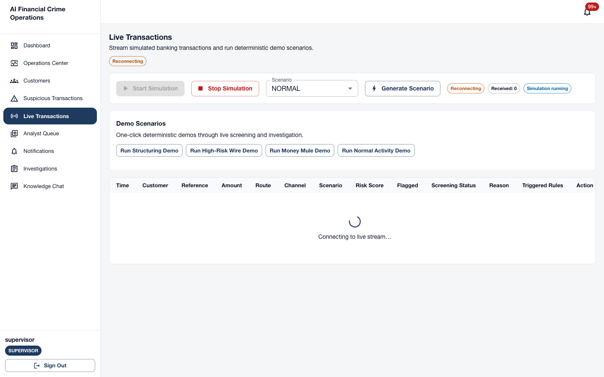
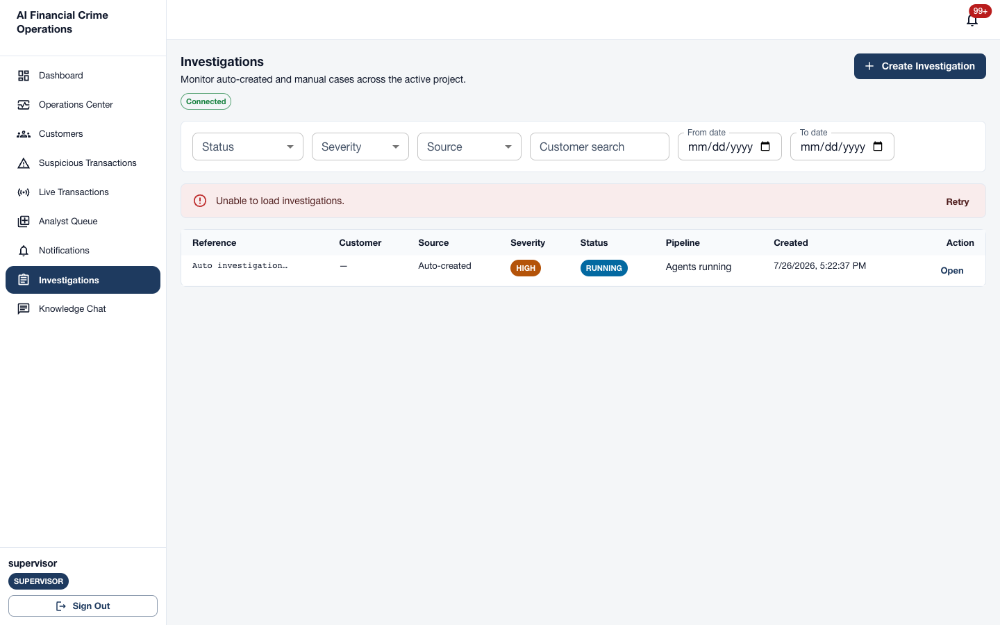

# AI Financial Crime Operations Platform

A full-stack **financial crime operations workbench** that simulates banking transactions, screens them for suspicious activity, automatically orchestrates multi-agent AI investigations, and routes cases through analyst assignment, human review, notifications, and operations monitoring. All customer and transaction data is **synthetic demo data** for local development and demonstration—not connected to any real bank or production payment network.

## Table of Contents

- [Problem Statement](#problem-statement)
- [End-to-End Workflow](#end-to-end-workflow)
- [Key Features](#key-features)
- [Architecture](#architecture)
- [AI Agents](#ai-agents)
- [Explainability and Fallback](#explainability-and-fallback)
- [Analyst Workflow](#analyst-workflow)
- [Notifications and Operations](#notifications-and-operations)
- [Authentication and RBAC](#authentication-and-rbac)
- [Tech Stack](#tech-stack)
- [Repository Structure](#repository-structure)
- [Prerequisites](#prerequisites)
- [Environment Variables](#environment-variables)
- [Database Setup](#database-setup)
- [Running the Application](#running-the-application)
- [Running Tests](#running-tests)
- [Demo Scenarios](#demo-scenarios)
- [Demo Users](#demo-users)
- [Screenshots](#screenshots)
- [Documentation](#documentation)
- [Known Limitations](#known-limitations)
- [Future Improvements](#future-improvements)

## Problem Statement

Financial institutions must detect fraud, money laundering, and compliance gaps across high volumes of transactions while maintaining explainable decisions and human oversight. Manual review alone does not scale; fully automated black-box models erode trust with regulators and analysts. This platform demonstrates a **hybrid approach**: rule-based screening and deterministic specialist agents produce structured, auditable findings; optional LLM narrative enriches reports; supervisors and analysts retain assignment, review, and decision authority.

## End-to-End Workflow

1. **Simulate** inbound transactions (continuous stream or one-shot demo scenarios).
2. **Screen** each transaction — status resolves to `CLEARED`, `SUSPICIOUS`, or `CRITICAL`.
3. **Auto-create investigations** for suspicious and critical hits.
4. **Execute** a supervisor-planned pipeline: Fraud → KYC → AML (conditional) → Compliance.
5. **Aggregate findings**, retrieve RAG evidence citations, and **generate an investigation report**.
6. **Await human review** — supervisors assign cases; analysts claim or review assigned work.
7. **Decide** — approve, reject, escalate, or request more investigation.
8. **Notify** stakeholders in real time via the Notification Center.
9. **Monitor** platform health and KPIs in the Operations Dashboard and Operations Center.

## Key Features

- Live transaction simulation with Server-Sent Events (SSE)
- Rule-based transaction screening with scored outcomes
- Automatic investigation creation from screening hits
- Multi-agent investigation orchestration with live execution timeline
- Investigation Command Center (findings, customer context, audit trail)
- Rule-level explainability per agent finding
- AI-assisted investigation reports with deterministic fallback
- Analyst queue with assign, claim, and unassign
- Human review workflow (start review, approve, reject, escalate)
- Real-time notification center with unread badge and SSE push
- Operations dashboard (KPIs, active cases, alerts) and operations center (health, metrics)
- JWT authentication with role-based access control
- PostgreSQL persistence with Flyway migrations
- Optional OpenAI integration for reports, chat, and knowledge search

## Architecture



See [docs/architecture.md](docs/architecture.md) for the full architecture guide and [docs/architecture/](docs/architecture/) for detailed diagrams.

## AI Agents

| Agent | Responsibility |
|-------|----------------|
| **Supervisor** | Builds deterministic execution plan (which agents run, in what order) |
| **Fraud** | Transaction patterns, structuring, rapid movement, high-risk geography |
| **KYC** | Customer identity, PEP exposure, profile consistency |
| **AML** | Money-laundering indicators when plan conditions are met |
| **Compliance** | Regulatory alignment across specialist outputs |

Specialist agents do **not** call OpenAI directly. They produce structured `AgentFinding` records stored in PostgreSQL.

## Explainability and Fallback

- **Explainability:** `ExplainabilityService` exposes the rules and indicators behind each finding—deterministic, not LLM-generated reasoning.
- **Report generation:** `InvestigationReportService` uses OpenAI when `OPENAI_API_KEY` is set; otherwise, or on failure, `DeterministicInvestigationReportGenerator` produces the full report.
- **Fallback notification:** Supervisors receive an `OPENAI_FALLBACK_MODE` notification when LLM report generation fails.

## Analyst Workflow

- Supervisors view the **Analyst Queue** and **assign** cases to fraud or compliance analysts.
- Analysts **claim** unassigned cases in `AWAITING_REVIEW`.
- Assigned analysts **start review**, evaluate findings and reports, then **approve**, **reject**, or **escalate**.
- All assignment and decision events are recorded in `investigation_case_events`.

## Notifications and Operations

- **Notification Center:** persisted notifications with unread count, mark-read, and SSE live stream.
- **Operations Dashboard:** transaction and investigation KPIs, live feeds, agent activity.
- **Operations Center:** platform health (database, SSE, OpenAI configuration), investigation metrics, error counters.

## Authentication and RBAC

| Role | Capabilities |
|------|--------------|
| `ADMIN` | Full access |
| `SUPERVISOR` | Simulation control, assignment, execution, dashboard |
| `FRAUD_ANALYST` | Claim and review fraud cases |
| `COMPLIANCE_ANALYST` | Claim and review compliance cases |
| `READ_ONLY` | View-only (GET endpoints) |

Authentication uses stateless **JWT** tokens. Identity is resolved server-side via `CurrentUserService`.

## Tech Stack

| Layer | Technology |
|-------|------------|
| Frontend | React 19, TypeScript, Vite 8, MUI 9, React Router 7, Axios |
| Backend | Java 21, Spring Boot 4, Spring Security, Spring Data JPA, Flyway |
| Database | PostgreSQL 16 with pgvector |
| AI | OpenAI API (optional) |
| Observability | Spring Actuator, Micrometer, Prometheus |

## Repository Structure

```
├── backend/                 # Spring Boot API, agents, screening, migrations
├── frontend/                # React SPA
├── docs/                    # Architecture docs and screenshots
├── scripts/                 # Screenshot capture utility
├── docker-compose.yml       # PostgreSQL only
└── .env.example
```

## Prerequisites

- Java 21
- Node.js 20+ and npm
- Docker and Docker Compose
- OpenAI API key (optional)

## Environment Variables

```bash
cp .env.example .env
```

| Variable | Required | Description |
|----------|----------|-------------|
| `OPENAI_API_KEY` | No | LLM reports, chat, embeddings |
| `DEMO_USER_PASSWORD` | Yes (local demo) | Password for seeded demo users; set in `.env` only |
| `VITE_API_URL` | No | Default `http://localhost:8080/api` |
| `VITE_PROJECT_ID` | No | Default project UUID for the UI |

See [.env.example](.env.example) for the full list.

## Database Setup

```bash
docker compose up -d
```

| Setting | Value |
|---------|-------|
| Host | `localhost:5433` |
| Database | `banking_platform` |
| Username | `banking_user` |

Flyway runs automatically on backend startup (migrations V1–V19).

## Running the Application

```bash
docker compose up -d
export DEMO_USER_PASSWORD='your-local-demo-password'   # from .env
cd backend && ./mvnw spring-boot:run
cd frontend && npm install && npm run dev
```

Open [http://localhost:5173](http://localhost:5173) (use `localhost`, not `127.0.0.1`, so CORS matches). Ensure only **one** backend instance uses port 8080.

## Running Tests

```bash
cd backend && ./mvnw clean test
cd frontend && npm run build
```

## Demo Scenarios

| Endpoint | Description |
|----------|-------------|
| `POST /api/simulation/start` | Start continuous stream |
| `POST /api/simulation/stop` | Stop simulation |
| `POST /api/simulation/demos/structuring` | Structuring pattern |
| `POST /api/simulation/demos/high-risk-wire` | High-risk wire |
| `POST /api/simulation/demos/money-mule` | Money mule pattern |
| `POST /api/simulation/demos/normal` | Cleared baseline traffic |

## Demo Users

When `auth.demo-users.enabled=true`, the backend seeds: `admin`, `supervisor`, `fraud.analyst`, `compliance.analyst`, `readonly`. Set `DEMO_USER_PASSWORD` in your local `.env` file (see `.env.example`). **Do not commit passwords to Git.**

## Screenshots

Authenticated captures from the running application (1440×900, synthetic demo data). Only `01-login.png` shows the sign-in screen; screenshots `02`–`13` require an active session.

| | |
|---|---|
|  | **Login** — sign-in screen (username only; password field empty) |
|  | **Operations Dashboard** — KPIs, live alerts, and investigation workload |
|  | **Live Transactions** — simulation stream and screening status |
|  | **Suspicious Transactions** — flagged screening outcomes |
|  | **Investigations** — case list with statuses and priorities |
|  | **Investigation Command Center** — pipeline timeline and case summary |
|  | **Agent Findings** — Fraud, KYC, AML, and Compliance outputs |
|  | **Explainability** — rule-level indicators per agent |
|  | **Investigation Report** — generated report with analyst recommendation |
|  | **Analyst Review Queue** — assignment partitions |
|  | **Notification Center** — unread alerts and history |
|  | **Operations Center** — platform health and metrics |
|  | **Human Review** — analyst decision workflow |

Re-capture after UI changes (requires running backend and frontend):

```bash
export DEMO_USER_PASSWORD='your-local-demo-password'
cd scripts && npm install && npx playwright install chromium
node capture-demo-screenshots.mjs
```

## Documentation

- [Architecture summary](docs/architecture.md)
- [Detailed architecture index](docs/architecture/README.md)

## Known Limitations

- Local-dev scope only—no production cloud infrastructure in-repo
- Synthetic mock banking data
- Docker Compose provides PostgreSQL only
- OpenAI optional; deterministic fallback when unavailable
- Single-node backend; no distributed queue

## Future Improvements

- Full-stack Docker Compose for frontend and backend
- CI pipeline for build and test
- Production secrets management
- PDF report export
- Playwright E2E tests in CI
