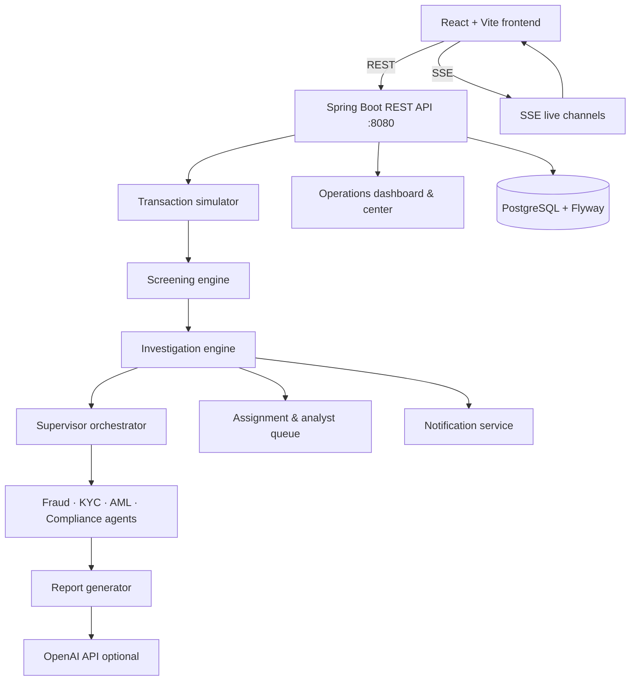
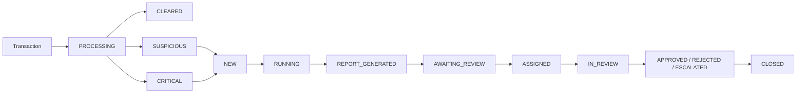

# Architecture — AI Financial Crime Operations Platform

This document summarizes the **implemented** architecture. Detailed breakdowns live in [`architecture/`](./architecture/README.md).

## System Overview

The frontend uses **Axios** for synchronous REST calls and **fetch-based SSE hooks** for live transaction feeds, investigation execution progress, and user notifications. Specialist agents are **deterministic rule engines**; OpenAI is used for report narrative, chat, and knowledge embeddings, with a **deterministic fallback** when the API key is missing or LLM calls fail.

## Investigation Lifecycle

Failure paths:

- **SCREENING_FAILED** — screening error; no auto-investigation
- **EXECUTION_FAILED** — agent pipeline error; retry via `POST /api/investigations/{id}/execute`

## AI Agent Orchestration

`SupervisorAgentService` builds a fixed execution plan:

1. **Fraud** — always
2. **KYC** — always
3. **AML** — conditional (amount, risk score, PEP, high-risk customer)
4. **Compliance** — always last

Each agent persists an `AgentFinding`. After execution, `InvestigationEvidenceService` retrieves RAG citations, `InvestigationReportService` generates the report (LLM merge or deterministic), and cases move to **AWAITING_REVIEW**.

## Security

- **JWT** login at `POST /api/auth/login`
- **Roles:** `ADMIN`, `SUPERVISOR`, `FRAUD_ANALYST`, `COMPLIANCE_ANALYST`, `READ_ONLY`
- **CurrentUserService** resolves identity server-side
- Notifications scoped per `user_id`

## Real-Time Channels

| Endpoint | Purpose |
|----------|---------|
| `GET /api/simulation/live` | Live simulated transactions |
| `GET /api/investigations/live` | Investigation creation & execution events |
| `GET /api/notifications/live` | User notification push |

## Data Store

PostgreSQL holds users, projects, mock banking data, screening results, investigation cases, agent findings, reports, audit events (`investigation_case_events`), and notifications. Schema managed by Flyway (V1–V19).

## Deployment (local)

| Component | Command |
|-----------|---------|
| Database | `docker compose up -d` |
| Backend | `cd backend && ./mvnw spring-boot:run` |
| Frontend | `cd frontend && npm run dev` |

See [deployment architecture](./architecture/deployment-architecture.md) for ports, environment variables, and health checks.

## Further Reading

- [System architecture](./architecture/system-architecture.md)
- [Investigation lifecycle](./architecture/investigation-lifecycle.md)
- [AI agent orchestration](./architecture/ai-agent-orchestration.md)
- [Security and RBAC](./architecture/security-and-rbac.md)
- [Data model](./architecture/data-model.md)
- [Deployment architecture](./architecture/deployment-architecture.md)
