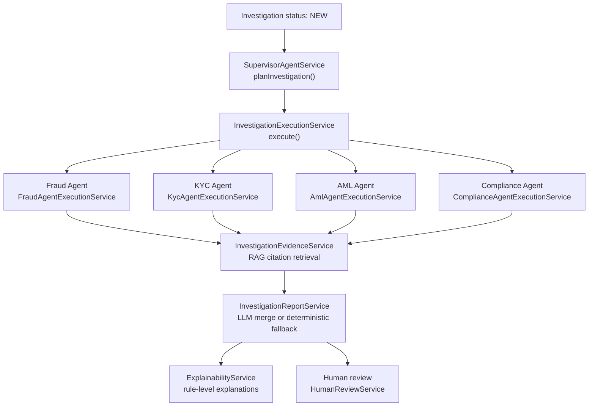
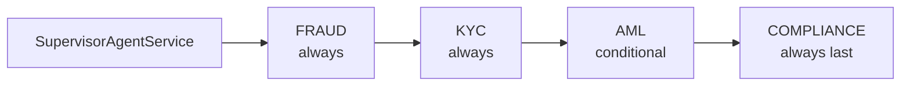
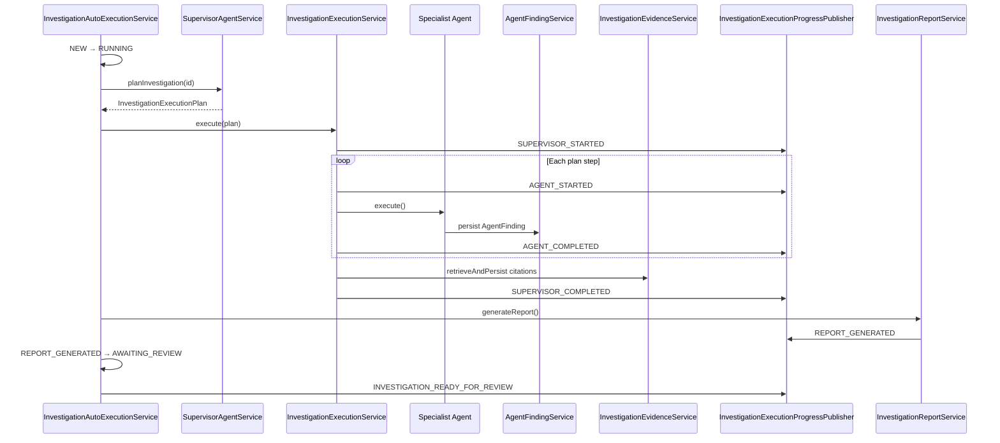
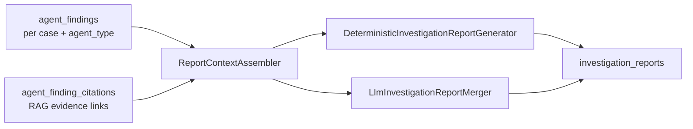
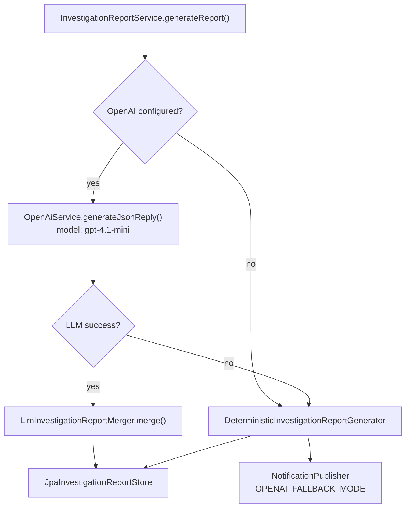

# AI Agent Orchestration

[← Investigation lifecycle](./investigation-lifecycle.md) · [Architecture index](./README.md) · [Security and RBAC →](./security-and-rbac.md)

The platform uses a **supervisor-orchestrated, multi-agent investigation pipeline**. The supervisor (`SupervisorAgentService`) builds a deterministic execution plan; specialist agents run rule-based analysis; findings are aggregated, explained, and synthesized into an investigation report with optional OpenAI narrative.

## Orchestration Overview

**Explanation:** Agent execution is **deterministic**—specialist agents do not call OpenAI. OpenAI is invoked only during report generation (and separately for chat/knowledge features).

## Supervisor Execution Plan

| Step | Agent | Condition |
|------|-------|-----------|
| 1 | **FRAUD** | Always included |
| 2 | **KYC** | Always included |
| 3 | **AML** | Included when any AML trigger matches: flagged transaction, amount > threshold (default $10,000), risk score > 75, customer `riskRating=HIGH`, or `pepStatus=PEP` |
| 4 | **COMPLIANCE** | Always included (runs after specialists) |

Plan output: `InvestigationExecutionPlan` with ordered `AgentExecutionStep` entries and `ExecutionPlanStatus.PLANNED`.

## Execution Sequence

Progress events are published to **`InvestigationNotificationHub`** (SSE) and selectively to **`NotificationPublisher`** (persisted notifications for report ready, execution failure, etc.).

## Specialist Agent Contributions

### Fraud Agent (`FraudAgentService`)

Analyzes transaction patterns against configurable thresholds:

- Large transactions, rapid movement, structuring
- High-risk countries, unusual channels
- Profile mismatch for new accounts
- Flagged transaction status and risk scores

**Output:** `AgentFinding` with fraud indicators, risk level, confidence score, and structured indicator list.

### KYC Agent (`KycAgentService`)

Evaluates customer identity and profile signals:

- KYC verification status
- PEP exposure
- Account age and nationality/residence mismatches
- Customer risk rating alignment

**Output:** KYC indicators (e.g., unverified identity, PEP match, stale documentation).

### AML Agent (`AmlAgentService`)

Triggered only when the supervisor plan includes AML. Focuses on anti–money laundering patterns:

- Transaction amount vs. customer profile
- High-risk jurisdiction exposure
- Structuring and velocity patterns
- PEP and high-risk customer combinations

**Output:** AML indicators with severity-weighted risk scoring.

### Compliance Agent (`ComplianceAgentService`)

Final specialist review for regulatory alignment:

- Policy adherence across prior agent findings
- Regulatory reporting triggers
- Cross-cutting compliance gaps

**Output:** Compliance indicators synthesizing specialist results into regulatory context.

## Findings Aggregation

Each agent persists one **`AgentFinding`** row per execution (status: `PENDING` → `RUNNING` → `COMPLETE` or `FAILED`). Citations link findings to knowledge document chunks when evidence retrieval succeeds.

> **Note:** There is no separate `agent_executions` table. Execution state is tracked through `agent_findings`, SSE execution events, and `investigation_case_events` audit records.

## Explainability

`ExplainabilityService` exposes rule-level explanations for completed findings:

- `GET /api/investigations/{id}/explainability` — case-level summary
- `GET /api/investigations/{id}/findings/{findingId}/explainability` — per-finding detail

Explainability is derived from the same deterministic rules that produced each indicator—not from LLM reasoning.

## Report Generation and Fallback

| Mode | When | Content |
|------|------|---------|
| `LLM` | OpenAI available and JSON parse succeeds | LLM narrative merged onto deterministic facts; analyst recommendation stays deterministic |
| `DETERMINISTIC` | No API key, retries exhausted, or parse failure | Full report from `DeterministicInvestigationReportGenerator` |

Deterministic sections include: executive summary, investigation overview, customer risk profile, fraud/KYC/AML/compliance analysis, supporting evidence, analyst recommendation, confidence explanation, and limitations.

Configuration: `investigation.report.max-retries=3`, `investigation.report.model=gpt-4.1-mini`, `investigation.report.prompt-version=1.0.0`.

## Analyst Review (Post-Orchestration)

After orchestration completes, the case is **`AWAITING_REVIEW`**. Analysts interact through:

- **Investigation workspace** — findings, report, timeline
- **Review page** — `HumanReviewService` for start review, approve, reject, escalate, request clarification
- **Assignment** — supervisor assign or analyst claim (`InvestigationAssignmentService`)

Human decisions are recorded in **`human_review_decisions`** and audited via **`investigation_case_events`**.

## SSE Execution Event Types

Published during orchestration (`InvestigationExecutionEventType`):

| Event | When |
|-------|------|
| `INVESTIGATION_CREATED` | Case auto-created from screening |
| `SUPERVISOR_STARTED` / `SUPERVISOR_COMPLETED` | Plan execution boundaries |
| `AGENT_STARTED` / `AGENT_COMPLETED` / `AGENT_FAILED` | Per-agent progress |
| `REPORT_GENERATION_STARTED` / `REPORT_GENERATED` | Report pipeline |
| `INVESTIGATION_READY_FOR_REVIEW` | Pipeline complete |
| `EXECUTION_FAILED` | Unrecoverable pipeline error |

## See Also

- [System Architecture](./system-architecture.md) — SSE channels and module map
- [Investigation Lifecycle](./investigation-lifecycle.md) — status transitions
- [Data Model](./data-model.md) — `agent_findings`, `investigation_reports`
