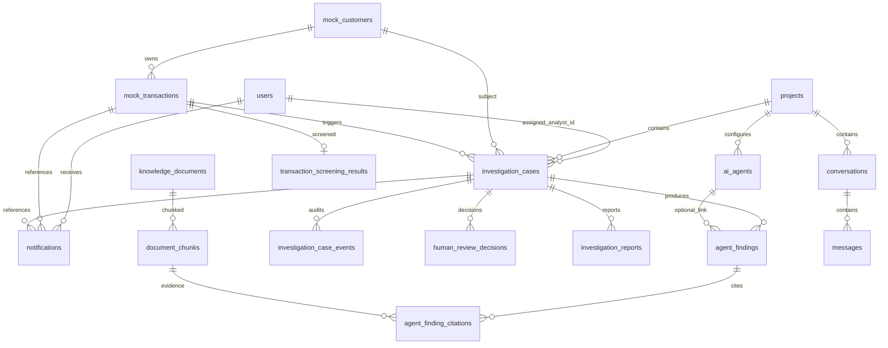
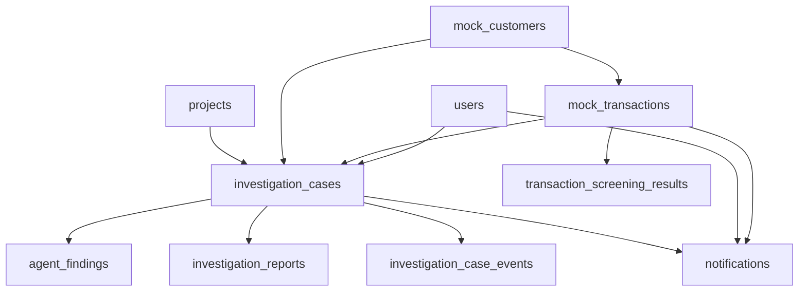
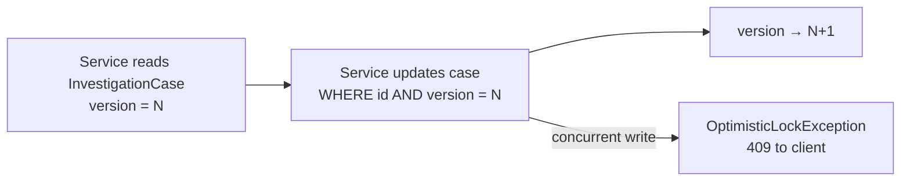

# Data Model

[← Security and RBAC](./security-and-rbac.md) · [Architecture index](./README.md) · [Deployment architecture →](./deployment-architecture.md)

PostgreSQL is the system of record. Schema is managed by **Flyway** (19 migrations as of V19). Hibernate validates against the schema (`spring.jpa.hibernate.ddl-auto=validate`).

## Entity Relationship Overview

**Explanation:** Investigations anchor the domain. They link to projects, customers, and transactions; agent findings and reports hang off cases; notifications and audit events provide operational visibility.

## Core Entities

### users

| Column | Notes |
|--------|-------|
| `id` | UUID primary key |
| `username` | Unique login |
| `password_hash` | BCrypt |
| `role` | `ADMIN`, `SUPERVISOR`, `FRAUD_ANALYST`, `COMPLIANCE_ANALYST`, `READ_ONLY` |
| `enabled` | Account active flag |

Seeded by `DemoUserSeeder` when demo users are enabled.

### projects

Investigation workspaces. Default project ID: `8c0c0dee-dd8e-4419-bef3-a2e93c10a726`.

| Relationship | Target |
|--------------|--------|
| `investigation_cases.project_id` | → `projects.id` |
| `conversations.project_id` | → `projects.id` |

### mock_transactions / mock_customers

Demo banking data for simulation and investigation subjects.

| Table | Key fields |
|-------|------------|
| `mock_customers` | `full_name`, `kyc_status`, `risk_rating`, `pep_status`, `account_number` |
| `mock_transactions` | `customer_id`, `amount`, `currency`, `channel`, `risk_score`, `flagged`, `simulation_scenario` |

### transaction_screening_results

One row per transaction (unique on `transaction_id`).

| Column | Notes |
|--------|-------|
| `status` | `PROCESSING`, `CLEARED`, `SUSPICIOUS`, `CRITICAL`, `SCREENING_FAILED` |
| `screening_score` | 0–100 |
| `triggered_rules` | JSON array of rule names |
| `screening_reason` | Human-readable summary |

### investigation_cases

Central case entity (`InvestigationCase` JPA entity).

| Column | Notes |
|--------|-------|
| `status` | See [Investigation Lifecycle](./investigation-lifecycle.md) |
| `case_type` | `FRAUD`, `KYC`, `AML`, `COMPLIANCE`, `MULTI` |
| `priority` | `LOW`, `MEDIUM`, `HIGH`, `CRITICAL` |
| `customer_id`, `transaction_id` | At least one required (CHECK constraint) |
| `assigned_analyst_id` | FK → `users.id` (V18) |
| `assigned_analyst_username`, `assigned_at`, `review_started_at` | Assignment metadata |
| `execution_failure_*` | Failure stage, message, timestamp (V16) |
| `screening_status`, `screening_reason`, `screening_triggered_rules` | Copied from screening (V14) |
| **`version`** | Optimistic lock (`@Version`) — V18 |

### agent_findings

Specialist agent output (there is **no separate `agent_executions` table**).

| Column | Notes |
|--------|-------|
| `case_id` | FK → `investigation_cases.id` |
| `agent_type` | `FRAUD`, `KYC`, `AML`, `COMPLIANCE` |
| `status` | `PENDING`, `RUNNING`, `COMPLETE`, `FAILED`, `PARSE_FAILED` |
| `risk_level` | Agent-specific enum mapped to string |
| `confidence_score` | 0.0–1.0 |
| `summary`, `indicators_json` | Structured analysis payload |
| `agent_id` | Optional FK → `ai_agents.id` |

### agent_finding_citations

RAG evidence links from findings to knowledge chunks.

| Column | Notes |
|--------|-------|
| `finding_id` | FK → `agent_findings.id` |
| `chunk_id` | FK → `document_chunks.id` |
| `relevance_score`, `excerpt` | Retrieval metadata |

### investigation_reports

Generated report artifacts (`InvestigationReportEntity`).

| Column | Notes |
|--------|-------|
| `case_id` | FK → `investigation_cases.id` |
| `generation_mode` | `DETERMINISTIC` or `LLM` |
| `prompt_version` | Report template version |
| `report_json` | Full structured report payload |
| `generated_at` | Timestamp |

### investigation_case_events (audit trail)

Persisted audit events via `InvestigationAuditService`. There is **no `audit_events` table**—this table serves that purpose.

| Column | Notes |
|--------|-------|
| `case_id` | FK → `investigation_cases.id` |
| `event_type` | e.g., `CASE_CREATED`, `HUMAN_DECISION`, `INVESTIGATION_ASSIGNED`, `AGENT_FINDING_PRODUCED` |
| `actor_username` | Who performed the action |
| `payload_json` | Event-specific details |
| `created_at` | Event timestamp |

### human_review_decisions

Records analyst/supervisor review outcomes linked to cases.

### notifications

User notification center (V19).

| Column | Notes |
|--------|-------|
| `user_id` | FK → `users.id` (recipient) |
| `type` | e.g., `INVESTIGATION_ASSIGNED`, `REPORT_GENERATED`, `AI_EXECUTION_FAILURE` |
| `severity` | `INFO`, `WARNING`, `CRITICAL` |
| `related_investigation_id` | Optional FK → `investigation_cases.id` |
| `related_transaction_id` | Optional FK → `mock_transactions.id` |
| `read` | Boolean, default `false` |

## Supporting Entities

| Table | Purpose |
|-------|---------|
| `ai_agents` | Configurable chat agents per project |
| `conversations` / `messages` | Chat history |
| `knowledge_documents` / `document_chunks` | RAG knowledge base (pgvector embeddings) |

## Major Foreign Keys

## Optimistic Locking

Optimistic locking on `investigation_cases.version` protects:

- **Assignment / claim** — two analysts cannot claim the same unassigned case
- **Status transitions** — concurrent pipeline and manual updates are detected

Implemented via JPA `@Version` on `InvestigationCase.version` (added in V18).

## Indexes (selected)

| Index | Table | Purpose |
|-------|-------|---------|
| `idx_notifications_user_read_created` | `notifications` | User inbox queries |
| `idx_investigation_cases_assignment_status` | `investigation_cases` | Analyst queue |
| `idx_agent_findings_case_type` | `agent_findings` | Per-case agent lookup |
| `idx_investigation_case_events_case_created` | `investigation_case_events` | Timeline ordering |

## Migration History

| Version | Description |
|---------|-------------|
| V1–V6 | Projects, agents, conversations, messages, knowledge/RAG |
| V7–V8 | Mock banking tables and seed data |
| V9 | Investigation domain (cases, findings, events, decisions) |
| V10 | Investigation reports |
| V11 | Users |
| V13 | Transaction screening results |
| V14 | Auto-investigation support |
| V15–V17 | Live execution statuses, failure support, scenario groups |
| V18 | Assignment columns, optimistic lock, `ASSIGNED`/`IN_REVIEW` statuses |
| V19 | Notifications table |

## See Also

- [Investigation Lifecycle](./investigation-lifecycle.md) — status values and transitions
- [AI Agent Orchestration](./ai-agent-orchestration.md) — findings and report generation
- [Security and RBAC](./security-and-rbac.md) — user roles and notification ownership
