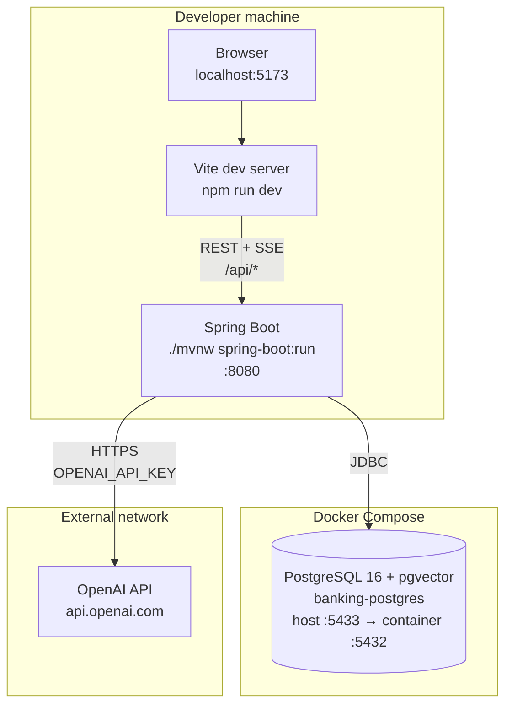
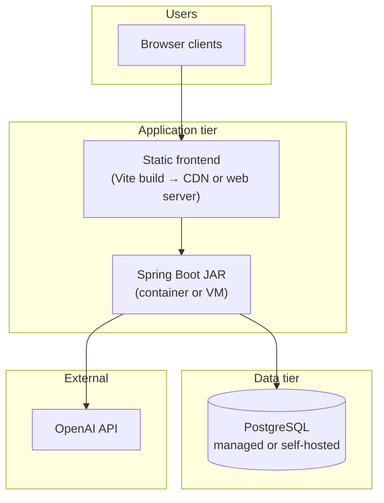
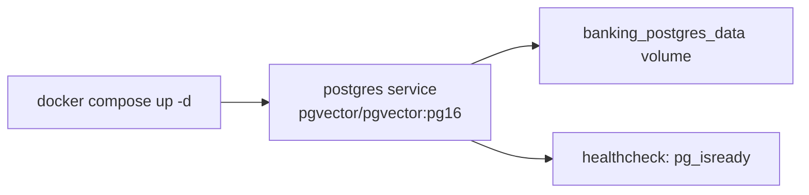
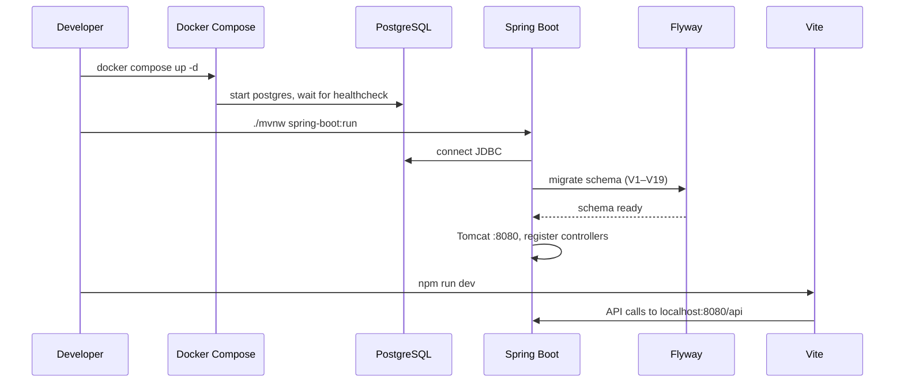
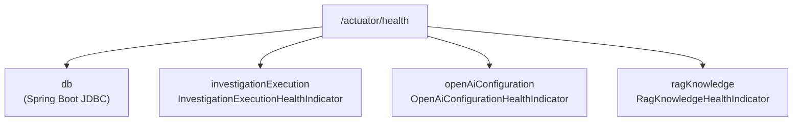

# Deployment Architecture

[← Data model](./data-model.md) · [Architecture index](./README.md)

This document describes how the platform runs locally today and what a production-ready deployment would look like based on **implemented** components. No cloud-specific infrastructure (Kubernetes, managed RDS, load balancers) is defined in the repository.

## Local Development Topology



**Explanation:** Only PostgreSQL runs in Docker. The frontend and backend are started directly on the host. This matches the current repository—there are no Dockerfiles for the application tiers.

## Production-Ready Topology (logical)



For production you would additionally configure: TLS termination, secrets management, CORS origins for your domain, and database backups. These are **recommended practices**, not implemented in-repo.

## Docker Compose

File: [`docker-compose.yml`](../../docker-compose.yml)



| Setting | Value |
|---------|-------|
| Container name | `banking-postgres` |
| Host port | `5433` |
| Database | `banking_platform` |
| User / password | `banking_user` / `banking_password` |
| Health check | `pg_isready -U banking_user -d banking_platform` every 10s |

## Port and URL Map

| Component | Address | Notes |
|-----------|---------|-------|
| Frontend (dev) | `http://localhost:5173` | Vite dev server |
| Backend API | `http://localhost:8080/api` | Spring Boot |
| Actuator health | `http://localhost:8080/actuator/health` | Public |
| Actuator info | `http://localhost:8080/actuator/info` | Public |
| Prometheus | `http://localhost:8080/actuator/prometheus` | ADMIN/SUPERVISOR only |
| PostgreSQL | `localhost:5433` | Docker-mapped |

## Startup Sequence



Always ensure **only one backend instance** listens on port 8080. A stale JVM running an older build is a common cause of missing API routes (e.g., notifications returning 401).

## Environment Variables

| Variable | Required | Purpose |
|----------|----------|---------|
| `OPENAI_API_KEY` | Optional | Report LLM, chat, embeddings. Without it, reports use deterministic fallback |
| `VITE_API_URL` | Optional (frontend) | Override API base URL (default `http://localhost:8080/api`) |
| `VITE_PROJECT_ID` | Optional (frontend) | Override default project UUID |

### Backend configuration (`application.properties`)

| Property | Default | Notes |
|----------|---------|-------|
| `server.port` | `8080` | HTTP port |
| `spring.datasource.url` | `jdbc:postgresql://localhost:5433/banking_platform` | JDBC URL |
| `spring.datasource.username` | `banking_user` | DB user |
| `spring.datasource.password` | `banking_password` | DB password |
| `auth.jwt.secret` | Dev secret in properties | **Change for production** |
| `auth.jwt.expiration-ms` | `86400000` (24h) | Token lifetime |
| `auth.demo-users.enabled` | `true` | Seed demo accounts |
| `spring.ai.openai.chat.options.model` | `gpt-4.1-mini` | Default chat/report model |
| `simulation.transactions.interval-ms` | `3000` | Simulation tick interval |
| `management.endpoints.web.exposure.include` | `health,info,prometheus` | Actuator exposure |

Database credentials can be overridden via standard Spring `spring.datasource.*` environment variables or an external config file.

## Health Checks



| Indicator | What it checks |
|-----------|----------------|
| `db` | PostgreSQL connectivity |
| `investigationExecution` | Investigation pipeline readiness |
| `openAiConfiguration` | Whether `OPENAI_API_KEY` is configured |
| `ragKnowledge` | Knowledge base / embedding readiness |

`management.endpoint.health.show-details=always` exposes component status in the health response.

## Frontend Build (non-dev)

```bash
cd frontend
npm run build    # output → frontend/dist/
```

Serve `frontend/dist/` via any static file host. Set `VITE_API_URL` at **build time** to point to your backend API.

## Backend Build (non-dev)

```bash
cd backend
./mvnw package -DskipTests
java -jar target/banking-engineering-backend-*.jar
```

Requires PostgreSQL reachable at the configured JDBC URL before startup (Flyway runs on boot).

## Observability

| Mechanism | Location |
|-----------|----------|
| Prometheus metrics | `/actuator/prometheus` |
| Custom counters | `BankingMetrics` — execution failures, report fallbacks |
| Correlation IDs | `CorrelationIdFilter` |
| Operations Center API | `GET /api/operations/center` — aggregates health for UI |

## Network and CORS

Backend CORS allows `http://localhost:5173` for `/api/**` and `/actuator/**`. Production deployments must update `SecurityConfig` / `CorsConfig` with the actual frontend origin.

SSE streams (`/api/simulation/live`, `/api/investigations/live`, `/api/notifications/live`) use long-lived HTTP connections through the same backend port.

## What Is Not in the Repository

The following are **not implemented** and should not be assumed:

- Application Dockerfiles or Kubernetes manifests
- CI/CD pipeline configuration
- Cloud-managed services (AWS, GCP, Azure)
- Redis, message queues, or separate worker processes
- Multi-region or horizontal backend scaling configuration

## See Also

- [System Architecture](./system-architecture.md) — component overview
- [Security and RBAC](./security-and-rbac.md) — JWT and CORS
- [Data Model](./data-model.md) — Flyway migrations and PostgreSQL schema
