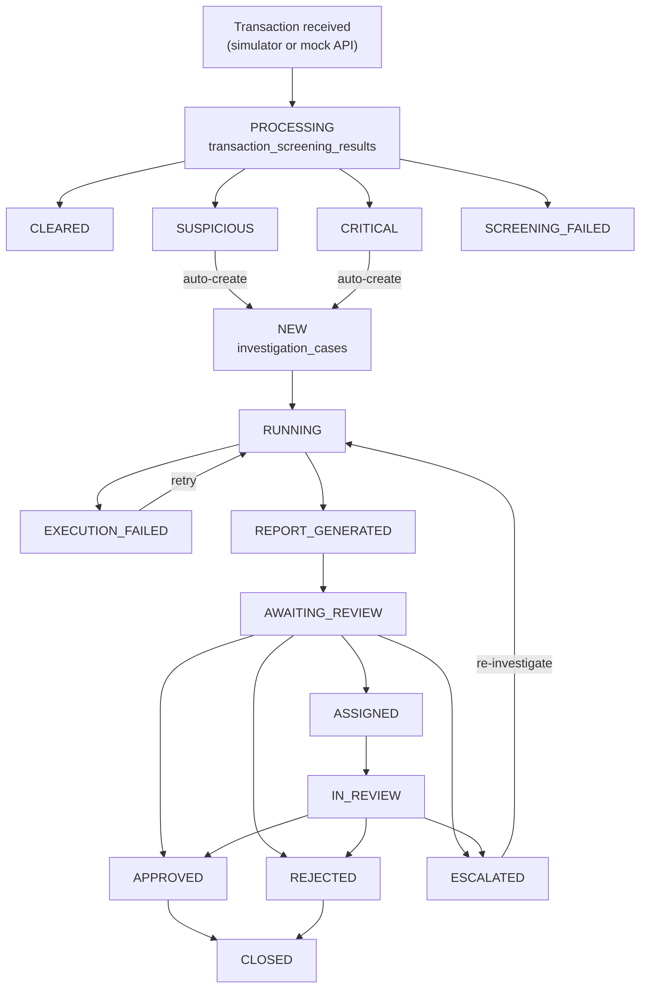
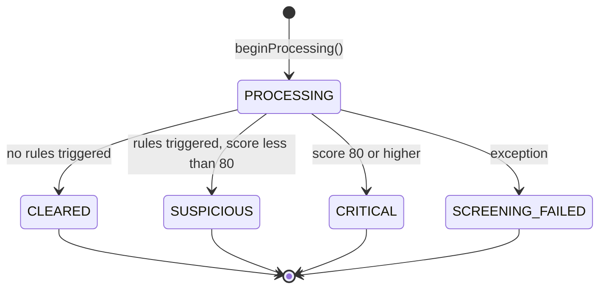
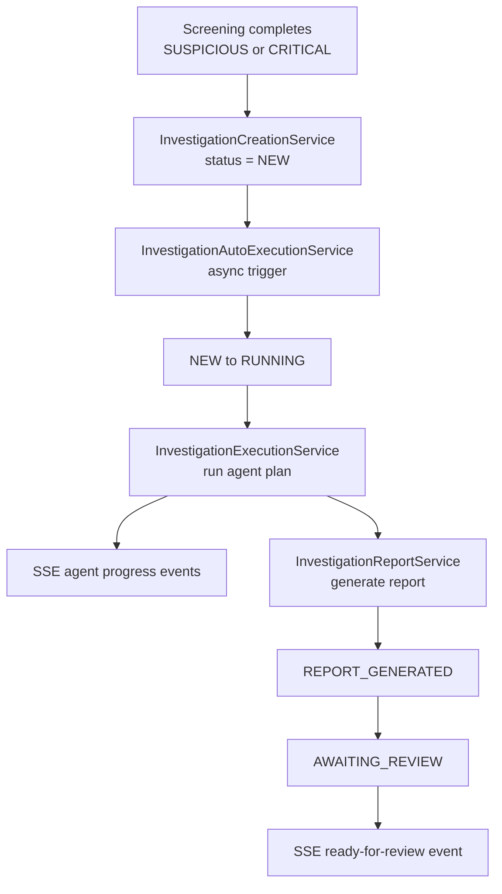
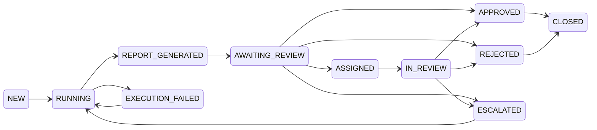
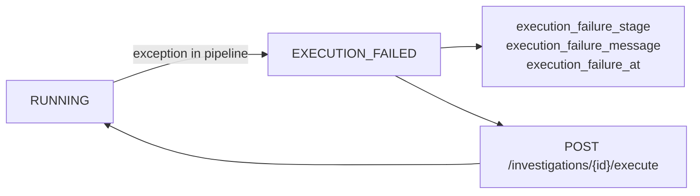
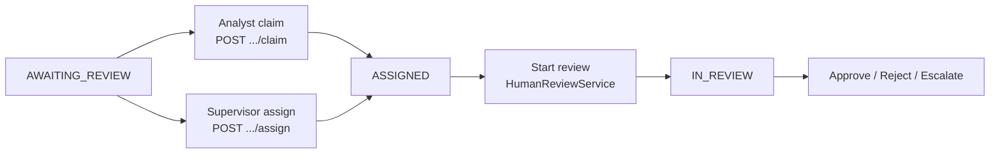

# Investigation Lifecycle

[← System architecture](./system-architecture.md) · [Architecture index](./README.md) · [AI agent orchestration →](./ai-agent-orchestration.md)

This document describes how a transaction moves from simulation through screening, automated investigation, human review, assignment, and closure.

## End-to-End Flow

**Explanation:** Only **SUSPICIOUS** and **CRITICAL** screening outcomes trigger automatic investigation creation (`InvestigationCreationService`). The automated pipeline moves cases through agent execution and report generation before landing in **AWAITING_REVIEW** for human action.

## Transaction Screening Stage

| Status | Meaning | Next step |
|--------|---------|-----------|
| `PROCESSING` | Screening row created | Rules evaluated in `TransactionScreeningService.screen()` |
| `CLEARED` | No rules fired | No investigation |
| `SUSPICIOUS` | Rules fired, score below 80 | Auto investigation (`priority=HIGH`) |
| `CRITICAL` | Score ≥ 80 | Auto investigation (`priority=CRITICAL`) |
| `SCREENING_FAILED` | Screening error | Logged; no auto investigation |

**Rules evaluated:** `FLAGGED_STATUS`, `HIGH_RISK_SCORE`, `LARGE_TRANSFER`, `STRUCTURING`, `RAPID_MOVEMENT`, `HIGH_RISK_COUNTRY`, `PEP_ACTIVITY`, `NEW_ACCOUNT_ACTIVITY`.

## Automated Investigation Pipeline

Manual re-execution: `POST /api/investigations/{id}/execute` (ADMIN/SUPERVISOR) from `NEW` or `EXECUTION_FAILED`.

## Investigation Case Statuses

All statuses are stored as strings on `investigation_cases.status` and validated by `InvestigationCaseService`.

### Automated pipeline statuses

| Status | Description |
|--------|-------------|
| `NEW` | Case created; awaiting auto-execution |
| `RUNNING` | Agent execution in progress |
| `REPORT_GENERATED` | Report persisted; transitioning to review |
| `EXECUTION_FAILED` | Pipeline failed; retryable |
| `AWAITING_REVIEW` | Report ready; awaiting supervisor/analyst action |

### Human workflow statuses

| Status | Description |
|--------|-------------|
| `ASSIGNED` | Supervisor assigned case to an analyst |
| `IN_REVIEW` | Assigned analyst actively reviewing |
| `APPROVED` / `REJECTED` | Human decision recorded |
| `ESCALATED` | Escalated for further investigation |
| `CLOSED` | Terminal state after approve/reject |

### Legacy manual statuses

The schema also supports **`OPEN`** and **`INVESTIGATING`** for manually created cases outside the auto pipeline. These coexist with the automated `NEW` → `RUNNING` flow.

## Allowed Transitions

Key transitions enforced by `InvestigationCaseService.ALLOWED_STATUS_TRANSITIONS`:

The automated pipeline covers `NEW` through `AWAITING_REVIEW`. Human review covers assignment, analyst review, decisions, and closure. `ESCALATED` can return to `RUNNING` for re-investigation.

## Failure and Retry

On failure:
- Case status → `EXECUTION_FAILED`
- Failure metadata persisted on `investigation_cases`
- SSE event `EXECUTION_FAILED` published
- Notification `AI_EXECUTION_FAILURE` sent to supervisors
- Metrics incremented (`BankingMetrics`)

## Assignment and Analyst Review

After **AWAITING_REVIEW**, cases enter the analyst workflow:

**Analyst queue** (`GET /api/analyst-queue`): partitions cases into `myQueue`, `unassigned`, `inReview`, `escalated`, and `allAssigned` (supervisors only).

## Audit Trail

Lifecycle events are recorded in **`investigation_case_events`** via `InvestigationAuditService` (not a separate `audit_events` table). Event types include `CASE_CREATED`, `AGENT_FINDING_PRODUCED`, `HUMAN_DECISION`, `INVESTIGATION_ASSIGNED`, `ANALYST_REVIEW_STARTED`, and others.

## See Also

- [AI Agent Orchestration](./ai-agent-orchestration.md) — what happens during `RUNNING`
- [Security and RBAC](./security-and-rbac.md) — who can assign, claim, and decide
- [Data Model](./data-model.md) — `investigation_cases`, `agent_findings`, `investigation_reports`
