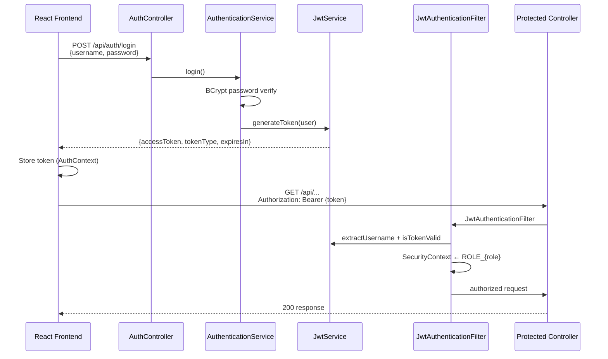
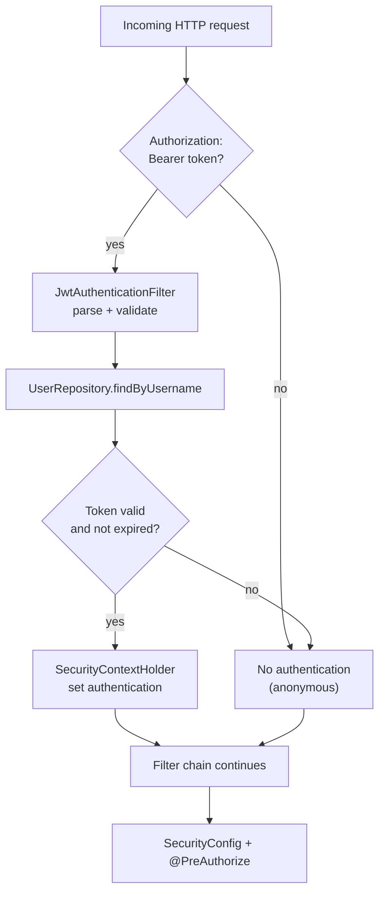
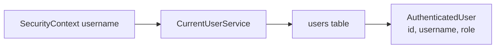
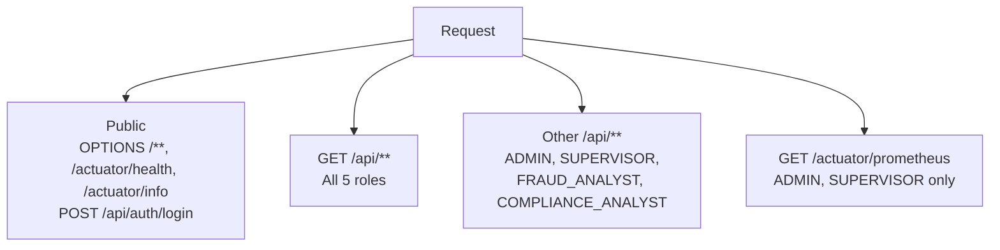
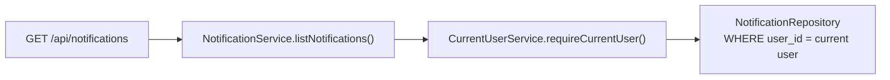

# Security and RBAC

[← AI agent orchestration](./ai-agent-orchestration.md) · [Architecture index](./README.md) · [Data model →](./data-model.md)

The platform uses **stateless JWT authentication** with **role-based access control (RBAC)** enforced at both the HTTP filter chain and method level (`@PreAuthorize`).

## Authentication Flow

**Explanation:** Sessions are not stored server-side. Each request carries a signed JWT; the filter rebuilds the Spring Security context from the token and the current `users` row.

## JWT Token Contents

Generated by `JwtService`:

| Claim | Value |
|-------|-------|
| `sub` | Username |
| `role` | `Role` enum name (e.g., `SUPERVISOR`) |
| `userId` | User UUID |
| Expiry | `auth.jwt.expiration-ms` (default 24 hours) |

Authority granted to Spring Security: `ROLE_{Role.name()}` (e.g., `ROLE_SUPERVISOR`).

## Request Authentication

Invalid or expired tokens clear the security context; protected endpoints then receive **401 Unauthorized** via `RestAuthenticationEntryPoint`.

Access denied (authenticated but insufficient role) returns **403 Forbidden** with message *"You do not have permission to perform this action"*.

## CurrentUserService

Server-side identity is always resolved from the authenticated security context—not from client-supplied user IDs:

| Method | Behavior |
|--------|----------|
| `requireCurrentUser()` | Loads `User` from DB; throws 401 if unauthenticated |
| `getCurrentUser()` | Optional lookup |
| `requireCurrentUserId()` | Returns UUID for ownership checks |

Controllers and services use `CurrentUserService` for notification scoping, analyst queue filtering, and assignment validation.

## Roles

| Role | Authority | Typical use |
|------|-----------|-------------|
| `ADMIN` | `ROLE_ADMIN` | Full platform access |
| `SUPERVISOR` | `ROLE_SUPERVISOR` | Operations oversight, assignment, simulation control |
| `FRAUD_ANALYST` | `ROLE_FRAUD_ANALYST` | Fraud case review, claim assigned work |
| `COMPLIANCE_ANALYST` | `ROLE_COMPLIANCE_ANALYST` | Compliance case review, claim assigned work |
| `READ_ONLY` | `ROLE_READ_ONLY` | View-only access to GET endpoints |

Demo users (when `auth.demo-users.enabled=true`): `admin`, `supervisor`, `fraud.analyst`, `compliance.analyst`, `readonly`. Password is configured via `DEMO_USER_PASSWORD` / `auth.demo-users.password` (local environment only).

## HTTP Authorization Rules

From `SecurityConfig`:

**Important:** `READ_ONLY` can call **GET** endpoints but is excluded from POST/PUT/PATCH/DELETE on `/api/**`.

Method-level `@PreAuthorize` adds finer rules on individual controllers (e.g., simulation start/stop, assignment, review decisions).

## Endpoint Authorization Examples

| Endpoint | Roles |
|----------|-------|
| `GET /api/notifications` | ADMIN, SUPERVISOR, FRAUD_ANALYST, COMPLIANCE_ANALYST, READ_ONLY |
| `POST /api/notifications/{id}/read` | Same (all authenticated read roles) |
| `POST /api/simulation/start` | ADMIN, SUPERVISOR |
| `POST /api/investigations/{id}/assign` | ADMIN, SUPERVISOR |
| `POST /api/investigations/{id}/claim` | FRAUD_ANALYST, COMPLIANCE_ANALYST |
| `POST /api/investigations/{id}/execute` | ADMIN, SUPERVISOR |
| Review approve/reject/escalate | Role-specific via `HumanReviewController` |

There is **no `ROLE_USER`** requirement anywhere in the codebase.

## Notification Ownership

- Notifications are **always scoped to the authenticated user** (`notifications.user_id`).
- An empty list returns **HTTP 200** with an empty page—not 403.
- `markRead` / `markAllRead` verify the notification belongs to the current user before updating.
- SSE stream `/api/notifications/live` subscribes to a **per-user** emitter in `NotificationEventHub`.

Optional `userId` query param on list is restricted to supervisors/admins for oversight; default behavior uses the current user.

## Assignment Restrictions

`InvestigationAssignmentService` enforces:

| Rule | Detail |
|------|--------|
| Assign / unassign | ADMIN or SUPERVISOR only |
| Claim | FRAUD_ANALYST or COMPLIANCE_ANALYST only |
| Assignable statuses | `AWAITING_REVIEW`, `ASSIGNED`, `ESCALATED` |
| Terminal statuses | Cannot assign: `APPROVED`, `REJECTED`, `CLOSED` |
| In-review guard | Cannot unassign while `IN_REVIEW` |
| Reassign during review | Blocked while status is `IN_REVIEW` |
| Optimistic locking | `@Version` on `InvestigationCase` prevents concurrent assignment conflicts |

Analyst queue (`AnalystQueueService`) filters by **project** and **current user**—analysts see their own assigned work; supervisors see broader queue partitions.

## CORS

Allowed origin: `http://localhost:5173` for `/api/**` and `/actuator/**` (configured in `SecurityConfig` and `CorsConfig`).

## Error Responses

| Status | Handler | Typical message |
|--------|---------|-----------------|
| 401 | `RestAuthenticationEntryPoint.commence()` | *Authentication is required* |
| 403 | `RestAuthenticationEntryPoint.handle()` | *You do not have permission to perform this action* |

The frontend (`apiError.ts`) distinguishes 401 with vs. without a Bearer token to guide users (session expired vs. backend/API mismatch).

## See Also

- [System Architecture](./system-architecture.md) — auth module placement
- [Data Model](./data-model.md) — `users`, `notifications`
- [Deployment Architecture](./deployment-architecture.md) — JWT secret and env configuration
