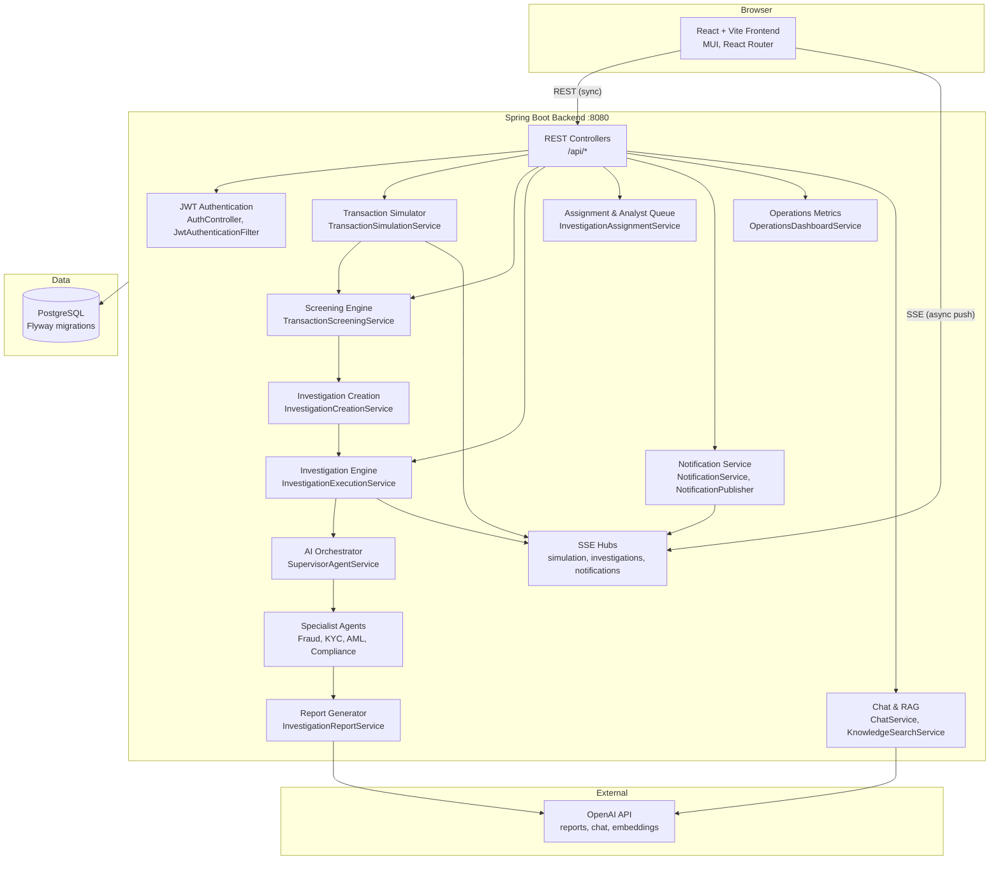
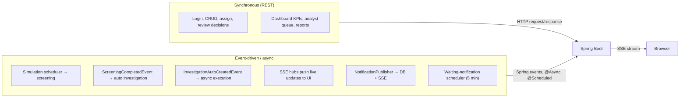
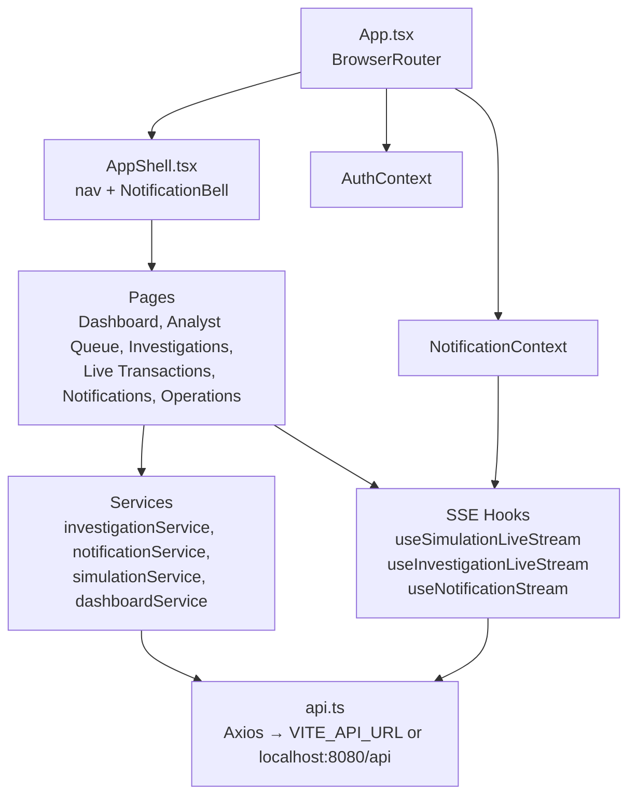
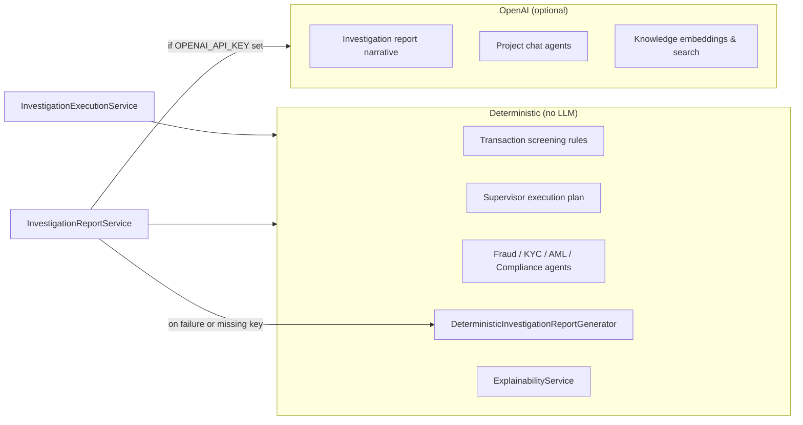

# System Architecture

[← Architecture index](./README.md) · [Investigation lifecycle →](./investigation-lifecycle.md)

The platform is a **financial crime operations workbench**: simulated transactions are screened, suspicious activity triggers automated multi-agent investigations, supervisors and analysts review outcomes, and operators monitor health through dashboards and notifications.

## High-Level Architecture

**Explanation:** The browser talks to Spring Boot over **synchronous REST** for commands and queries, and over **Server-Sent Events (SSE)** for live transaction feeds, investigation execution progress, and user notifications. Screening and investigation pipelines run inside the backend; OpenAI is used for report narrative, chat, and knowledge embeddings—not for the deterministic specialist agents.

## Communication Patterns

| Pattern | Examples | Latency model |
|---------|----------|---------------|
| **Synchronous REST** | `POST /api/auth/login`, `GET /api/dashboard/operations`, `POST /api/investigations/{id}/assign` | Client waits for response |
| **Async in-process** | Auto-execution after investigation creation (`InvestigationAutoExecutionTrigger`) | Returns immediately; work continues in thread pool |
| **SSE push** | `/api/simulation/live`, `/api/investigations/live`, `/api/notifications/live` | Server pushes events as they occur |
| **Scheduled** | Transaction simulation interval (3s), investigation-waiting notifications (5 min) | Background polling |

## Frontend Architecture

Default API base: `http://localhost:8080/api` (override with `VITE_API_URL`). Default project: `8c0c0dee-dd8e-4419-bef3-a2e93c10a726` (`VITE_PROJECT_ID`).

## Backend Module Map

| Package | Responsibility |
|---------|----------------|
| `auth` | JWT login, `CurrentUserService`, demo user seeding |
| `simulation` | Mock transaction generation, demo scenarios, simulation SSE |
| `screening` | Rule-based transaction screening, status resolution |
| `investigation` | Case lifecycle, findings, execution, review, assignment |
| `investigation.supervisor` | Execution plan (`SupervisorAgentService`) |
| `investigation.fraud/kyc/aml/compliance` | Deterministic specialist analysis |
| `investigation.report` | LLM + deterministic report generation |
| `investigation.assignment` | Analyst queue, assign / claim / unassign |
| `notification` | Persisted notifications, SSE, domain hooks |
| `dashboard` / `operations` | Operations KPIs and platform health |
| `chat` / `knowledge` | Conversational AI and RAG over uploaded documents |
| `mockdata` | Demo customers and transactions |
| `observability` | Metrics, correlation IDs, custom health indicators |

## Live SSE Channels

| Endpoint | Hub | Event purpose |
|----------|-----|---------------|
| `GET /api/simulation/live` | `TransactionSimulationEventHub` | Live transaction + screening updates |
| `GET /api/investigations/live` | `InvestigationNotificationHub` | Investigation created, execution progress |
| `GET /api/notifications/live` | `NotificationEventHub` | User-scoped notification push |
| `POST /api/chat/stream` | `StreamingChatService` | Token streaming for project chat |

All SSE endpoints require JWT authentication (Bearer token via fetch stream, not native `EventSource`).

## OpenAI vs Deterministic Logic

Specialist agents produce structured **findings** stored in PostgreSQL. Report generation merges LLM narrative with deterministic facts; failures fall back to pure deterministic output and emit an `OPENAI_FALLBACK_MODE` notification.

## Operations Surfaces

| Surface | API | Purpose |
|---------|-----|---------|
| Operations Dashboard | `GET /api/dashboard/operations` | Fraud ops KPIs, active cases, live alerts |
| Operations Center | `GET /api/operations/center` | Platform health (DB, SSE, OpenAI), error counters |
| Actuator | `/actuator/health`, `/actuator/prometheus` | Infrastructure health and Prometheus metrics |

## See Also

- [Investigation Lifecycle](./investigation-lifecycle.md) — status transitions from screening to closure
- [AI Agent Orchestration](./ai-agent-orchestration.md) — supervisor plan and agent responsibilities
- [Deployment Architecture](./deployment-architecture.md) — ports, Docker Compose, environment variables
